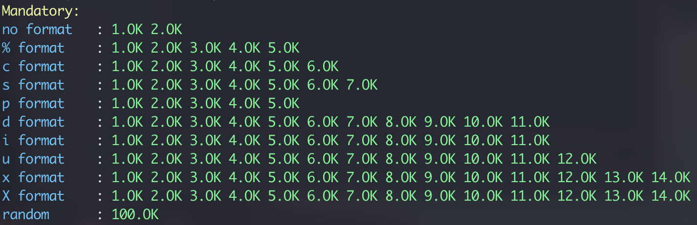

<div align="center>

# ft_printf
#### *Because ft_putnbr() and ft_putstr() aren’t enough*

[](https://forthebadge.com)
</div>

Second project for [42 school](https://42.fr/en/homepage/). We have to recode a simpler `printf()` function which handles the `cspdiuxX%` conversions. 

## Prototype

```c
int ft_printf(const char *str, ...);
```

## Supported format specifiers

| Specifier | Output |
| :-------: | ---- |
| `%c` | a single character |
| `%s` | a string (as defined by the common C convention) |
| `%p` | a void * pointer printed in hexadecimal format |
| `%d` | a decimal (base 10) number |
| `%i` | an integer in base 10 |
| `%u` | an unsigned decimal (base 10) number |
| `%x` | a number in hexadecimal lowercase format |
| `%X` | a number in hexadecimal uppercase format |
| `%%` | a percent sign |

## Compilation

The makefile creates a library called `libftprintf.a`. The following rules are available : 
* `make`
* `make all`
* `make clean`
* `make fclean`
* `make re`

## Tests

### [printfTester](https://github.com/Tripouille/printfTester)


### [francinette](https://github.com/xicodomingues/francinette/blob/master/testers/printf)


### [francinette --strict](https://github.com/xicodomingues/francinette/blob/master/testers/printf)
